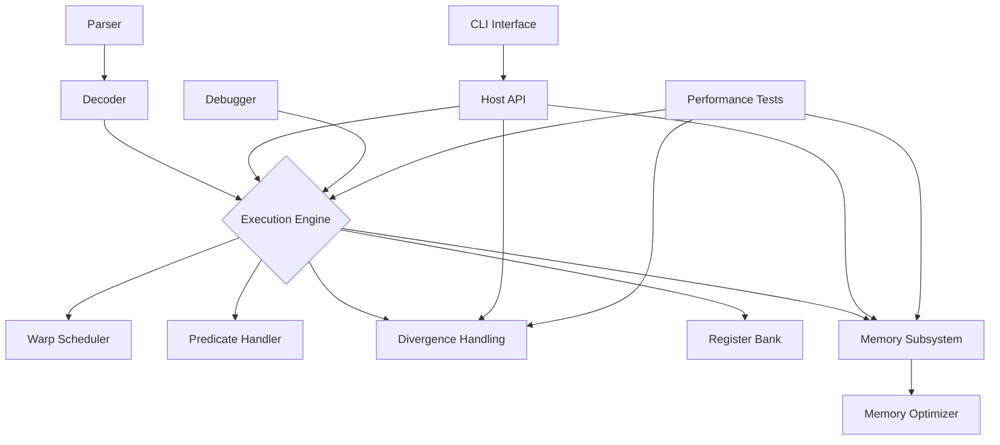

# Developer Guide for PTX Virtual Machine

## Introduction
This document provides essential information for developers working on the PTX Virtual Machine project. It covers code structure, contribution guidelines, build instructions, and other important details to help new contributors get started.

For information about future development plans, please refer to the [Next Phase Development Plan](docs/next_phase_development_plan.md).

The PTX Virtual Machine project is hosted on GitHub at: https://gitee.com/hanzhenzhong/ptx-vm

## Code Structure Overview

### Directory Layout
```
.
├── include/                # Public header files
│   ├── host_api.hpp        # Main host API interface
│   ├── cuda_binary_loader.hpp  # CUDA binary loader interface
│   ├── performance_counters.hpp  # Performance counters interface
│   ├── vm.hpp              # VM core interface
│   └── ...
├── src/                    # Source code directory
│   ├── core/               # VM core components
│   │   ├── performance_counters.cpp
│   │   ├── vm.cpp
│   │   ├── vm.hpp
│   │   └── vm_profiler.cpp
│   ├── decoder
│   │   ├── decoder.cpp
│   │   └── decoder.hpp
│   ├── execution
│   │   ├── divergence_reconvergence.cpp
│   │   ├── executor.cpp
│   │   ├── executor.hpp
│   │   ├── predicate_handler.cpp
│   │   ├── predicate_handler.hpp
│   │   ├── reconvergence_mechanism.hpp
│   │   ├── warp_scheduler.cpp
│   │   └── warp_scheduler.hpp
│   ├── memory
│   │   ├── memory.cpp
│   │   ├── memory.hpp
│   │   └── memory_optimizer.cpp
│   ├── optimizer
│   │   ├── instruction_scheduler.cpp
│   │   ├── instruction_scheduler.hpp
│   │   ├── register_allocator.cpp
│   │   └── register_allocator.hpp
│   ├── parser              # PTX parser module
│   │   ├── parser.cpp
│   │   └── parser.hpp
│   ├── registers           # Register bank module
│   │   ├── register_bank.cpp
│   │   └── register_bank.hpp
│   └── host
│       ├── cli_interface.cpp
│       ├── cuda_binary_loader.cpp
│       └── host_api.cpp
├── tests/                  # Unit and integration tests
│   ├── executor_tests
│   │   ├── basic_math_tests.cpp
│   │   └── control_flow_tests.cpp
│   ├── memory_tests
│   │   └── advanced_memory_tests.cpp
│   ├── performance_benchmarks
│   │   └── register_allocation_benchmark.cpp
│   └── system_tests
│       ├── performance_test.cpp
│       ├── smoke_test.cpp
│       ├── reconvergence_performance_test.cpp
│       ├── memory_performance_test.cpp
│       ├── executor_performance_test.cpp
│       └── divergence_performance_test.cpp
├── examples/               # Example PTX programs
│   └── memory_optimization_examples.md  # Documentation for memory optimization examples
└── docs/                   # Project documentation
    ├── api_documentation.md  # API documentation
    ├── developer_guide.md
    ├── user_guide.md         # User guide documentation
    ├── performance_testing.md  # Performance testing documentation
    ├── warp_scheduler.md     # Warp scheduler documentation
    ├── predicate_handler.md  # Predicate handler documentation
    ├── divergence_handling.md  # Divergence handling documentation
    ├── memory_optimizations.md  # Memory optimizations documentation
    ├── cuda_binary_loader.md  # CUDA binary loader documentation
    ├── divergence_performance_testing.md  # Divergence handling performance testing documentation
    ├── visualization_features.md  # Visualization features documentation
    └── CMakeLists.txt
```

### Component Interaction Diagram


## Contribution Guidelines

### Getting Started
1. Fork the repository
2. Create a feature branch (`git checkout -b feature/my-feature`)
3. Make your changes with appropriate commit messages
4. Run tests to ensure nothing is broken
5. Submit a pull request

### Coding Standards
- Use C++20 features where appropriate
- Follow consistent naming conventions:
  - Classes: `UpperCamelCase`
  - Functions: `lowerCamelCase`
  - Variables: `lower_snake_case`
- Keep functions focused on single responsibilities
- Write clear comments for complex logic
- Document all public APIs

### Git Commit Messages
- Use conventional commits format:
  - `feat`: New features
  - `fix`: Bug fixes
  - `docs`: Documentation changes
  - `style`: Formatting, no logic changes
  - `refactor`: Code refactoring
  - `perf`: Performance improvements
  - `test`: Adding or modifying tests
  - `chore`: Routine maintenance tasks

## Build and Installation Instructions

### Prerequisites
- CMake 3.14+
- C++20 compatible compiler:
  - GCC 10+
  - Clang 12+
  - MSVC VS2019 16.10+
- Google Test (for unit testing)

### Building the Project
```bash
# Clone the repository
mkdir build && cd build

# Configure with CMake
cmake ..

# Build the project
make
```

### Build Options
- `BUILD_TESTS=ON/OFF` - Enable/disable unit tests
- `BUILD_EXAMPLES=ON/OFF` - Enable/disable example programs
- `BUILD_DOCUMENTATION=ON/OFF` - Enable/disable documentation building

### Testing
The test suite includes multiple test types:
- Unit tests for individual components
- Integration tests for system-level behavior
- Performance benchmarks

To run tests after building:
```bash
# Run all tests
make test

# Or run specific tests
ctest -R "execution_tests"  # Run only execution-related tests
```

## Technical Reference

### Core Components

#### VM Core (`src/core`)
- Implements basic VM functionality
- Contains performance counters
- Provides VM interface

#### Instruction Parser (`src/parser`)
- Parses PTX assembly files into internal representation
- Handles file I/O and error reporting
- Interfaces with the decoder component

#### Instruction Decoder (`src/decoder`)
- Converts PTX assembly to internal representation
- Handles operand parsing
- Validates instruction syntax

#### Execution Engine (`src/execution`)
- Main executor class
- Warp scheduler with SIMT support
- Predicate handler for conditional execution
- Divergence handling and reconvergence mechanism

#### Memory Subsystem (`src/memory`)
- Memory space management
- Memory access operations
- Memory optimizer with caching and coalescing

#### Optimizer (`src/optimizer`)
- Dynamic register allocation
- Instruction scheduling optimizations
- Performance optimization framework

#### Register Bank (`src/registers`)
- General purpose register management
- Predicate register handling
- Register allocation interface

#### Debugger (`src/debugger`)
- Breakpoint management
- Watchpoint implementation
- State inspection capabilities
- Visualization features for warp execution, memory access, and performance counters

#### Host API (`src/host`)
- Main host-side interface
- CLI implementation
- CUDA binary loader

## System Architecture

### Execution Flow
1. Parse command-line arguments
2. Load PTX program or CUDA binary
3. Initialize VM components
4. Parse PTX code (if needed)
5. Decode instructions
6. Execute instructions with warp scheduling
7. Handle divergence and control flow
8. Manage memory accesses
9. Output results and statistics

### Thread Execution Model
The VM uses a SIMT execution model similar to real GPUs:
- Threads are organized into warps
- All threads in a warp execute in lockstep
- Predicates determine which threads execute each instruction
- Branches can cause warps to diverge
- Divergent paths must be reconverged

## Parameter Passing Mechanism

### Overview
The PTX VM now supports enhanced parameter passing mechanisms for kernel execution. This allows users to pass data directly to kernels, similar to how parameters are passed in real CUDA applications.

### Implementation Details

#### Data Structures
- `KernelParameter`: Represents a single kernel parameter with device pointer, size, and offset information
- `KernelLaunchParams`: Contains kernel launch configuration including grid/block dimensions and parameter list

#### Memory Management
Parameters are stored in a dedicated parameter memory space starting at address `0x1000`. Each parameter is sequentially stored with proper alignment.

#### API Functions
- `cuLaunchKernel`: Main function for launching kernels with parameters
- `cuMemAlloc`: Allocate memory in the VM
- `cuMemcpyHtoD`/`cuMemcpyDtoH`: Copy data between host and device memory

#### CLI Commands
- `alloc <size>`: Allocate memory in VM
- `memcpy <dest> <src> <size>`: Copy memory within VM
- `write <address> <value>`: Write a single byte value to memory
- `fill <address> <count> <value1> [value2] ...`: Fill memory with multiple values
- `loadfile <address> <file> <size>`: Load data from a file into VM memory
- `launch <kernel> [params]`: Launch kernel with parameters

### Usage Examples

#### Host API Usage
``cpp
// Allocate memory for parameters
CUdeviceptr inputPtr, outputPtr;
cuMemAlloc(&inputPtr, 1024 * sizeof(int));
cuMemAlloc(&outputPtr, 1024 * sizeof(int));

// Copy data to VM
std::vector<int> inputData(1024);
// ... populate inputData ...
cuMemcpyHtoD(inputPtr, inputData.data(), 1024 * sizeof(int));

// Launch kernel with parameters
std::vector<void*> kernelParams = {
    reinterpret_cast<void*>(inputPtr),
    reinterpret_cast<void*>(outputPtr),
    nullptr
};

cuLaunchKernel(
    functionHandle,
    1, 1, 1,     // Grid dimensions
    32, 1, 1,    // Block dimensions
    0,           // Shared memory
    nullptr,     // Stream
    kernelParams.data(),
    nullptr
);
```

#### CLI Usage
``bash
# Allocate memory
> alloc 4096
Allocated 4096 bytes at address 0x10000
> alloc 4096
Allocated 4096 bytes at address 0x10100

# Initialize memory with specific values
> fill 0x10000 4 1 2 3 4
Filled 4 bytes at address 0x10000

# Or load data from a file
> loadfile 0x10100 input.bin 1024
Loaded 1024 bytes from input.bin to address 0x10100

# Launch kernel with parameters
> launch myKernel 0x10000 0x10100
Launching kernel: myKernel
Kernel launched successfully
```

### Implementation Files
- `src/host/host_api.cpp`: Implementation of CUDA-like API functions
- `src/core/vm.cpp`: Core VM parameter handling
- `src/host/cli_interface.cpp`: CLI command implementations
- `include/vm.hpp`: VM class definition with parameter handling methods
- `include/host_api.hpp`: Host API interface definitions

## Development Practices

### Testing Philosophy
- All components should have comprehensive unit tests
- System-level tests validate overall behavior
- Performance benchmarks track optimization effectiveness
- Tests should cover edge cases and error conditions

### Debugging Tips
- Use the CLI interface for manual inspection
- Set breakpoints to examine state at specific points
- Use watchpoints to monitor memory changes
- Enable verbose logging for detailed execution traces
- Use visualization features to understand runtime behavior

### Performance Optimization
- Focus on critical path optimizations first
- Use profiling data to identify bottlenecks
- Optimize for common cases
- Avoid premature optimization

## Continuous Improvement

### Feedback Process
- Regular code reviews
- Community engagement through issues and PRs
- Incorporate user feedback
- Monitor performance trends

### Maintenance Schedule
- Weekly bug triage
- Monthly release cycles
- Quarterly architecture reviews
- As-needed optimization cycles

## Documentation Structure

The project maintains comprehensive documentation in the `docs/` directory:

### User-Facing Documentation
- **user_guide.md**: For end-users and application developers
  - Installation instructions
  - Basic usage
  - Command reference
  - Advanced features
  - Troubleshooting

### Developer Documentation
- **developer_guide.md**: For contributors and developers
  - Code structure overview
  - Contribution guidelines
  - Build instructions
  - Testing practices
  - Development philosophy
  - Maintenance schedule

### Technical Documentation
- **api_documentation.md**: Detailed API reference
  - Class interfaces
  - Data structures
  - Error handling
  - Versioning

- **reconvergence_mechanism.md**: Technical details on divergence handling
  - Divergence algorithms
  - Stack-based predication
  - Control flow graph analysis
  - Performance impact

- **memory_optimizations.md**: Details on memory system implementation
  - Memory hierarchy
  - Cache simulation
  - Shared memory bank conflicts
  - Memory coalescing
  - TLB and page fault handling

- **cuda_binary_loader.md**: Technical details on CUDA binary loading
  - File format detection
  - ELF parsing for CUBIN
  - FATBIN parsing
  - PTX extraction
  - Kernel metadata handling

- **performance_testing.md**: Performance testing framework and results
  - Test categories
  - Performance metrics
  - Test results and comparisons
  - Integration with build system

- **warp_scheduler.md**: Technical details on warp scheduling implementation
  - SIMT execution model
  - Divergence stack implementation
  - Predicate handling
  - Execution state management

- **predicate_handler.md**: Technical details on predicate handling implementation
  - Predicate registers
  - SIMT execution model
  - Divergence algorithms
  - Predicate evaluation

- **divergence_handling.md**: Technical details on divergence handling
  - Divergence statistics
  - Divergence algorithms
  - Divergence tracking
  - Reconvergence points

- **memory_optimization_examples.md**: Example programs for memory optimization testing
  - Coalesced memory access
  - Strided memory access
  - Shared memory bank conflicts
  - TLB and page fault handling
  - Complex memory access patterns

- **divergence_performance_testing.md**: Divergence handling performance testing
  - Performance testing framework
  - Test implementations
  - Performance metrics
  - Algorithm comparison
  - Long-running divergence testing

- **visualization_features.md**: Details on visualization capabilities
  - Warp execution visualization
  - Memory access visualization
  - Performance counter display
  - Integration with CLI interface

### Documentation Generation
Documentation is generated using standard markdown and integrated into the build system. The documentation module is configured in `docs/CMakeLists.txt`.

## Release Process

### Versioning
The project follows semantic versioning (SemVer):
- MAJOR version for incompatible API changes
- MINOR version for backward-compatible functionality
- PATCH version for backward-compatible bug fixes

### Release Checklist
Before each release:
1. Update version numbers in CMakeLists.txt
2. Update VERSION file
3. Update CHANGELOG.md with changes since last release
4. Update RELEASE_NOTES.md with release-specific information
5. Verify all tests pass
6. Update documentation as needed
7. Create release tag
8. Publish release artifacts

### Post-Release Activities
After each release:
1. Create new "Unreleased" section in CHANGELOG.md
2. Update project roadmap
3. Gather feedback from users
4. Plan next release

## Author Information
- **Zhenzhong Han** - Lead Developer and Architect
  - Email: zhenzhong.han@qq.com
  - Role: Chief architect and main developer of the PTX Virtual Machine
  - Contributions: Core VM implementation, execution engine, memory system, documentation, testing