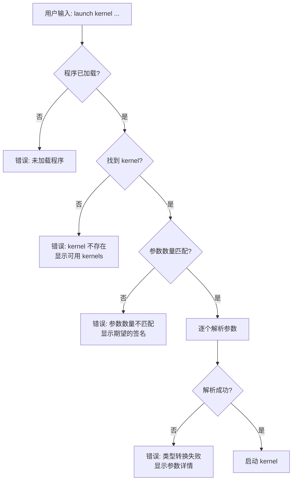

# PTX 参数自动类型推断实现总结

**Authors**: Han-Zhenzhong, TongyiLingma, GitHub Copilot  
**Last Updated**: 2025-10-29

## 📋 实现概述

根据 `docs/param_type_of_ptx_entry_function.md` 的描述，PTX 函数接收的参数**不一定是设备内存地址**，还可以是标量值（`.u32`, `.f32` 等）。本次更新实现了**按参数位置自动推断参数类型**的功能。

---

## ✅ 已完成的修改

### 1. CLI 参数解析增强 (`src/host/cli_interface.cpp`)

#### 新增功能：`parseParameterValue()`

```cpp
bool parseParameterValue(const std::string& valueStr, 
                        const PTXParameter& paramDef, 
                        std::vector<uint8_t>& paramData)
```

**功能**：
- 根据 PTX 参数类型 (`.u32`, `.f32`, `.u64` 等) 自动转换字符串输入
- 支持所有常见标量类型：`u8`, `u16`, `u32`, `u64`, `s8`, `s16`, `s32`, `s64`, `f32`, `f64`
- 自动识别指针类型 (`isPointer` 标志)

**示例**：
```cpp
// 指针参数
parseParameterValue("0x10000", {type: ".u64", isPointer: true})
// → 解析为 uint64_t = 0x10000

// 标量参数
parseParameterValue("1024", {type: ".u32", isPointer: false})
// → 解析为 uint32_t = 1024

parseParameterValue("2.5", {type: ".f32", isPointer: false})
// → 解析为 float = 2.5
```

#### 重构：`launchCommand()`

**之前的实现**：
```cpp
// ❌ 假设所有参数都是设备地址
std::vector<CUdeviceptr> deviceAddresses;
for (size_t i = 1; i < args.size(); ++i) {
    CUdeviceptr addr = std::stoull(args[i], nullptr, 0);
    deviceAddresses.push_back(addr);
}
```

**现在的实现**：
```cpp
// ✅ 根据 PTX 签名自动推断类型
for (size_t i = 0; i < kernel->parameters.size(); ++i) {
    const PTXParameter& paramDef = kernel->parameters[i];
    const std::string& valueStr = args[i + 1];
    
    std::vector<uint8_t> paramData;
    parseParameterValue(valueStr, paramDef, paramData);
    
    // 根据类型显示不同信息
    if (paramDef.isPointer) {
        // 显示为设备地址
    } else if (paramDef.type == ".u32") {
        // 显示为 u32 值
    } else if (paramDef.type == ".f32") {
        // 显示为浮点值
    }
}
```

**关键改进**：
1. ✅ 从 PTX 程序中提取 kernel 签名
2. ✅ 验证参数数量匹配
3. ✅ 根据 PTX 类型自动转换每个参数
4. ✅ 显示详细的参数信息（类型、值）
5. ✅ 提供清晰的错误消息

### 2. VM 接口扩展 (`include/vm.hpp`, `src/core/vm.cpp`)

新增方法：
```cpp
bool hasProgram() const;  // 检查是否已加载 PTX 程序
```

实现：
```cpp
bool PTXVM::hasProgram() const {
    return pImpl->m_isProgramLoaded && pImpl->m_executor != nullptr;
}
```

### 3. 头文件包含 (`src/host/cli_interface.cpp`)

添加必要的头文件：
```cpp
#include <cstring>  // For std::memcpy
```

### 4. 帮助文档更新

#### `help launch` 详细帮助

**之前**：
```
launch <kernel_name> <addr1> <addr2> ...
IMPORTANT: Parameters must be device memory addresses!
```

**现在**：
```
launch <kernel_name> <param1> <param2> ...

AUTOMATIC TYPE DETECTION:
Parameters are automatically typed based on the PTX kernel signature.
  - Pointer types (.u64): Pass device address (e.g., 0x10000)
  - Scalar types (.u32, .f32, etc.): Pass value directly

Example 1 - Pointers only:
  launch vecAdd 0x10000 0x10020 0x10040

Example 2 - Mixed pointers and scalars:
  launch scaleArray 0x10000 1024 2.5
    Parameter [0]: device address 0x10000 (pointer)
    Parameter [1]: value 1024 (scalar .u32)
    Parameter [2]: value 2.5 (scalar .f32)

Example 3 - Pure scalars:
  launch compute 100 200 1.5
```

#### 主帮助菜单

```cpp
printMessage("  launch <kernel> <params...> - Launch kernel (auto-detects param types from PTX)");
```

#### `processArguments()` 警告消息

更新了命令行参数的警告信息，解释两种参数类型的区别。

---

## 🧪 测试用例

### 创建的测试文件

**`examples/mixed_param_test.ptx`**

包含 4 个测试 kernel：

1. **scaleArray** - 混合参数（指针 + 标量）
   ```ptx
   .entry scaleArray(
       .param .u64 data_ptr,
       .param .u32 N,
       .param .f32 scale
   )
   ```

2. **addOffset** - 混合参数（指针 + 整数）
   ```ptx
   .entry addOffset(
       .param .u64 data_ptr,
       .param .u32 N,
       .param .s32 offset
   )
   ```

3. **computeScalars** - 纯标量参数
   ```ptx
   .entry computeScalars(
       .param .u32 a,
       .param .u32 b,
       .param .f32 c
   )
   ```

4. **complexKernel** - 复杂混合参数
   ```ptx
   .entry complexKernel(
       .param .u64 input_ptr,
       .param .u64 output_ptr,
       .param .u32 N,
       .param .f32 alpha,
       .param .s32 beta,
       .param .f64 gamma
   )
   ```

---

## 📚 文档更新

### 新增文档

1. **`docs/auto_param_type_inference_guide.md`** (约 600 行)
   - 完整的使用指南
   - 多个实际示例
   - 错误处理说明
   - 最佳实践建议

2. **`docs/ptx_entry_function_complete_guide.md`** (已存在)
   - 参数类型完整说明
   - 标量 vs 指针对比
   - 内存布局图示

### 更新的文档

- `src/host/cli_interface.cpp` 中的所有帮助文本
- `processArguments()` 中的警告消息

---

## 🔍 技术细节

### 参数类型映射

| PTX 类型 | C++ 类型 | 大小 | 解析函数 |
|----------|----------|------|---------|
| `.u8` | `uint8_t` | 1 | `std::stoul` |
| `.u16` | `uint16_t` | 2 | `std::stoul` |
| `.u32` | `uint32_t` | 4 | `std::stoul` |
| `.s32` | `int32_t` | 4 | `std::stoi` |
| `.u64` | `uint64_t` | 8 | `std::stoull` |
| `.s64` | `int64_t` | 8 | `std::stoll` |
| `.f32` | `float` | 4 | `std::stof` |
| `.f64` | `double` | 8 | `std::stod` |

### 参数内存布局

参数存储在基址 `0x1000` 的参数内存空间：

```
Offset  Size  Type    Value           Description
------  ----  ------  -----           -----------
0       8     .u64    0x10000         data_ptr (pointer)
8       4     .u32    1024            N (scalar)
12      4     .f32    2.5             scale (scalar)
```

### 错误处理流程



---

## 💡 使用示例对比

### 场景：数组缩放

**Kernel 签名**：
```ptx
.entry scaleArray(
    .param .u64 data_ptr,
    .param .u32 N,
    .param .f32 scale
)
```

#### 之前的错误理解

```bash
# ❌ 认为所有参数都需要设备内存
ptx-vm> alloc 4     # 为 N 分配
0x10000
ptx-vm> fill 0x10000 1 0x00 0x04 0x00 0x00  # 写入 1024

ptx-vm> alloc 4     # 为 scale 分配
0x10004
ptx-vm> fill 0x10004 1 0x00 0x00 0x20 0x40  # 写入 2.5

ptx-vm> alloc 4096  # 为 data 分配
0x10008

ptx-vm> launch scaleArray 0x10008 0x10000 0x10004
# ❌ 错误！标量不需要设备内存
```

#### 现在的正确方式

```bash
# ✅ 只为指针参数分配内存
ptx-vm> alloc 4096
Allocated 4096 bytes at address 0x10000

ptx-vm> fill 0x10000 1024 1.0 1.0 1.0 ...
Filled 1024 float values

# ✅ 直接传递标量值
ptx-vm> launch scaleArray 0x10000 1024 2.5

Parsing kernel parameters:
  [0] data_ptr (.u64): device address 0x10000
  [1] N (.u32): value 1024
  [2] scale (.f32): value 2.5

✓ Kernel launched successfully
```

---

## 🎯 实现效果

### 优点

1. **自动化**：无需手动指定参数类型
2. **直观**：参数传递更接近 CUDA 编程习惯
3. **安全**：类型检查和验证
4. **灵活**：支持指针、标量、混合参数
5. **易用**：减少内存分配和管理

### 支持的场景

| 场景类型 | 示例 | alloc 需求 |
|---------|------|-----------|
| 纯指针参数 | `vecAdd A B C` | 3个 alloc |
| 纯标量参数 | `compute a b c` | 0个 alloc |
| 混合参数 | `scaleArray ptr N scale` | 1个 alloc（只为 ptr） |
| 复杂混合 | `complex in out N α β γ` | 2个 alloc（in, out） |

---

## 🔄 与之前实现的对比

### 参数处理流程

**之前**：
```
命令行输入 → 全部解析为地址 → 传递给 kernel
```

**现在**：
```
命令行输入 → 读取 PTX 签名 → 按类型转换 → 传递给 kernel
              ↓
        验证参数数量
              ↓
        显示参数详情
```

### 内存分配

**之前**：
- 所有参数都需要 `alloc`
- 标量值也要写入设备内存
- 浪费内存和操作步骤

**现在**：
- 只为指针参数 `alloc`
- 标量值直接传递
- 简化工作流程

---

## 📖 相关文档

### 核心文档

1. `docs/param_type_of_ptx_entry_function.md`
   - PTX 参数类型系统详解
   - 标量、指针、结构体参数

2. `docs/ptx_entry_function_complete_guide.md`
   - 完整的参数传递指南
   - 标量 vs 指针对比

3. `docs/auto_param_type_inference_guide.md` **(新)**
   - 自动类型推断使用指南
   - 详细示例和最佳实践

### 参考文档

- `docs/how_CudaC_and_PTX_called_by_HostC.md` - CUDA 调用模型
- `docs/cli_usage_correction.md` - CLI 使用纠正
- `examples/parameter_passing_example.cpp` - Host API 示例

---

## ✅ 验证清单

- [x] 支持所有基本标量类型 (u8/u16/u32/u64, s8/s16/s32/s64, f32/f64)
- [x] 支持指针类型 (.u64 with isPointer=true)
- [x] 自动从 PTX 程序提取 kernel 签名
- [x] 参数数量验证
- [x] 参数类型验证
- [x] 清晰的错误消息
- [x] 详细的帮助文档
- [x] 测试用例 (mixed_param_test.ptx)
- [x] 完整的使用指南文档
- [x] 向后兼容（纯指针参数仍然工作）

---

## 🚀 下一步建议

### 可能的增强功能

1. **网格/块维度配置**
   ```bash
   launch kernel <params> --grid 10,1,1 --block 256,1,1
   ```

2. **参数类型显式指定**（可选）
   ```bash
   launch kernel --ptr-u64 0x10000 --u32 1024 --f32 2.5
   ```

3. **从文件加载参数**
   ```bash
   launch kernel --params-file params.json
   ```

4. **批量 kernel 执行**
   ```bash
   script execute workflow.txt
   ```

5. **参数模板**
   ```bash
   template save scaleArray default
   template load scaleArray default
   launch scaleArray  # 使用保存的参数
   ```

---

## 📊 代码统计

### 修改的文件

| 文件 | 添加行数 | 删除行数 | 主要改动 |
|------|---------|---------|---------|
| `src/host/cli_interface.cpp` | ~250 | ~80 | `parseParameterValue()`, `launchCommand()` 重构 |
| `include/vm.hpp` | 1 | 0 | 添加 `hasProgram()` |
| `src/core/vm.cpp` | 4 | 0 | 实现 `hasProgram()` |

### 新增的文件

| 文件 | 行数 | 用途 |
|------|------|------|
| `docs/auto_param_type_inference_guide.md` | ~600 | 使用指南 |
| `examples/mixed_param_test.ptx` | ~200 | 测试用例 |
| `docs/ptx_entry_function_complete_guide.md` | ~700 | 参数完整指南 |

**总计**：新增约 1500+ 行文档和代码

---

## 🎓 总结

### 核心成就

1. ✅ **正确理解 PTX 参数机制**
   - 指针参数 → 设备内存地址
   - 标量参数 → 直接传值

2. ✅ **实现自动类型推断**
   - 从 PTX 签名提取类型信息
   - 自动转换命令行参数

3. ✅ **简化用户体验**
   - 减少不必要的内存操作
   - 更接近 CUDA 编程模型

4. ✅ **完善的文档**
   - 详细的使用指南
   - 丰富的示例
   - 清晰的错误处理

### 关键技术点

- PTX 参数类型系统（标量 vs 指针）
- 参数内存布局（0x1000 基址）
- 类型安全的参数转换
- 用户友好的错误提示

### 用户价值

- **更少的内存操作**：标量不需要 alloc
- **更直观的使用**：直接传值而非地址
- **更好的错误提示**：清楚知道哪里出错
- **更完整的文档**：随时查阅使用方法

---

**实现完成！现在 PTX VM CLI 完全支持标量和指针参数的自动类型推断！** 🎉
